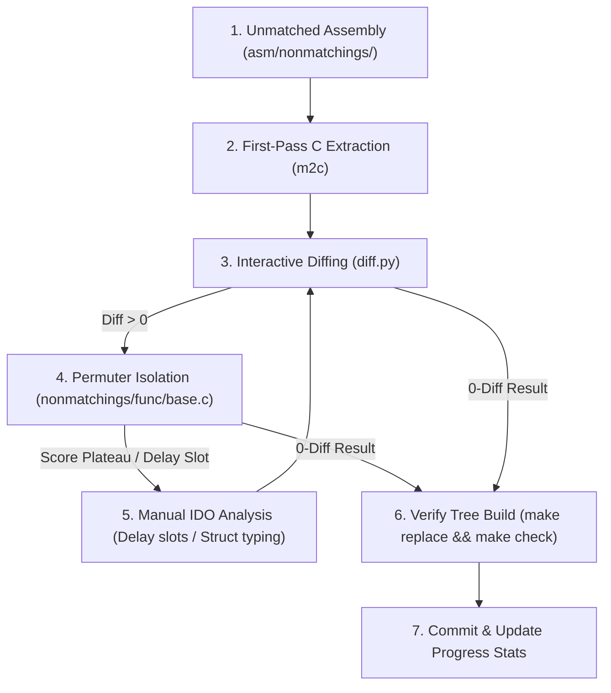

# Conker's Bad Fur Day Decompilation Index

## 1. Overview & Objectives
This repository contains an ongoing, byte-perfect decompilation of **Conker's Bad Fur Day (N64, US)**. 
The project utilizes `n64splat` for ROM splitting, `ido-static-recomp` (SGI IDO 5.3) for C compilation, and `asm-processor` to integrate assembly with C source. The target is 100% bit-for-bit equivalence against `baserom.us.z64` verified by SHA1 checksum.

---

## 2. Architecture & Segment Topology

The executable is divided into three primary segments defined in `conker/conker.us.yaml` and compiled into `build/conker.ld`:

| Segment | ROM / VRAM Context | Scope & Responsibilities | Progress & Function Count |
|---|---|---|---|
| **`init`** | ROM `0x1000 - 0x42C50`<br>VRAM `0x10001000` | Hardware boot sequence, TLB setup, exception handling, libultra OS, thread scheduling, and `rzip` decompression. | ~622 functions (~31.3% matched) |
| **`game`** | ROM `0x42C50 - 0x186B50` (Compressed)<br>VRAM `0x80034CE0` | Core game engine: actor loops, player physics, collision detection, camera math, animations, and level rendering. | ~7,271 functions (~6.0% matched) |
| **`debugger`**| ROM `0x19EA88 - 0x1A2190`<br>VRAM `0x80242860` | Development debugging hooks, crash handler, memory dumps, and text print routines. | ~182 functions (~88% matched) |

### Key Hardware & Runtime Entry Points
- **Boot Entry (`init_1050.c`)**: `func_10001050` at `0x10001000` resets memory, establishes thread 1 (`func_100010F8`) and thread 3 (`func_10001194`), and initializes libultra OS.
- **Game Entry (`entrypoint.c`)**: `0x80034CE0` executed after decompression and thread handoff.
- **RSP / RDP Graphics**: Display list generation using standard `gSP` and `gDP` macros across `game_*.c` (e.g., `game_45B80.c`, `game_476D0.c`).

---

## 3. Sister Codebases & Engine Lineage (Cross-Referencing)

Conker's engine is an evolution of Rareware's proprietary N64 codebase. When reversing unknown structs, variables, or functions, **always cross-reference sister repositories**:

### Reference Repositories
- **`c:\repos\banjo-kazooie`**: Primary reference for Rareware's original engine conventions, memory management, math libraries, and object systems (`src/core1`, `src/core2`).
- **`c:\repos\BanjoRecomp`** & **`c:\repos\Donkey-Kong-64-Recompiled`**: Modern decompilation and PC port trees. Invaluable for documented struct definitions, symbol naming, asset layouts, and hardware abstraction layer (HAL) behavior.

### Cross-Referencing Strategies
1. **De-obfuscating Opaque Structs**:
   - Monolithic structs in `conker/include/structs.h` (e.g., `struct127`, `struct210`, `struct247`) often map 1:1 or with minor extensions to known Banjo/DK64 actor, camera, or matrix structures.
   - Inspect BK's `include/` and `src/core1/` headers to map unknown offsets (`unkXX`) to concrete variable types, vector arrays, and linked-list pointers.
2. **Rareware Idiomatic Patterns**:
   - **Linked List Traversal**: Standard Rare loop convention:
     ```c
     do {
         // processing
     } while ((curr = next) != NULL);
     ```
   - **Asset Decompression**: Rare's `rzip` wrapper (gzip pre-1.5 `memzero` behavior with a 4-byte uncompressed size header).

---

## 4. IDO 5.3 Compiler Quirks & Matching Heuristics

The target compiler is SGI IDO 5.3 (`-O2 -mips2 -G 0`). It exhibits deterministic but subtle scheduling and register allocation behaviors:

### A. Delay Slot Scheduling & The "Permuter Plateau"
- **Issue**: Automated permuters frequently plateau at a small score diff (e.g., score 5) on branch/jump delay slots (`jal`, `beq`, `bnel`) because dead assignments are pruned by IDO's scheduler.
- **Manual Delay-Slot Forcing**: Precomputing pointer math (e.g., `s32 *p = arg0 - 3;` followed by `*(p + 2)`) preserves pending computations that IDO lazily schedules into branch delay slots, preventing register clobbering and forcing target instructions before `jal`.

### B. Stack Frame Layout & Variable Sandwiching
- IDO assigns local stack offsets strictly based on declaration order and data alignment.
- When stack slots drift (e.g., `sp28` landing at `0x24($sp)` or `0x2C($sp)`):
  - Use **variable sandwiching**: Reorder or interleave dummy pointers/structs (`void *temp_v0; struct_12b sp28; void *temp_v1;`) to force the struct precisely onto its required stack offset.

### C. Variadic Function Prologues
- Any function with a 32-byte frame (`addiu $sp, $sp, -0x20`) that immediately spills `$a0-$a3` to `0x20($sp)`, `0x24($sp)`, `0x28($sp)`, and `0x2C($sp)` is an IDO variadic function (`void func(const char *fmt, ...)` using `<stdarg.h>`).

### D. Multi-Dimensional Array Arithmetic & Struct Decomposition
- MIPS shift/multiply sequences like `(idx * 1888) + (arg1 * 236)` represent nested 2D array indexing `236 * (idx * 8 + arg1)`.
- When encountering large structs (e.g., `sizeof == 0x760` / 1888 bytes), check if they decompose into arrays of smaller sub-structs (e.g., 8 elements of size `0xEC` / 236 bytes).

### E. Concrete Struct Access vs. Raw Pointer Casts
- Accessing struct fields via concrete typed members (`arg0->unk24`) guides IDO's register allocator to match delay slot register ordering (`addu $a2, $v1, $t3`). Raw void pointers or integer casting often invert operand registers (`addu $a2, $t3, $v1`).

### F. Calling Conventions & Argument Spills
- **Small Struct Assignment**: Rareware passed small 4-byte structs by assignment (`sp1C = *(struct_4b *)D_800AB168;`), resulting in `lui; addiu; lw $at` and a store into `$a0` in a `jal` delay slot.
- **Callee Signatures**: Typing callee arguments as `void *` in `include/functions.h` prevents callers from generating unnecessary intermediate register moves (such as `$v0` copies).
- **Leaf Spills**: Coax floating-point/argument register spills (`$f12, $f14, $a2, $a3`) into the caller's frame via dummy assignments.

---

## 5. Development & Decompilation Workflow

Sub-agents must follow this 4-tier pipeline when targeting unmatched functions:



### Step 1: Initial Extraction (`m2c`)
- Locate unmatched assembly in `conker/asm/nonmatchings/`.
- Decompile with `m2c` (run inside Docker container with pycparser and IDO headers):
  ```bash
  python3 tools/mips_to_c/m2c.py --target mips-ido-c --context ctx.c asm/nonmatchings/.../func_XXXXXXXX.s
  ```

### Step 2: Interactive Visual Diffing (`asm-differ`)
- Inspect instruction and register differences side-by-side:
  ```bash
  ./diff.py -m -w func_XXXXXXXX
  ```

### Step 3: Permuter Isolation (`decomp-permuter`)
- For functions close to matching (diff score < 100), isolate the function and compile script inside `nonmatchings/<func_name>/base.c`.
- Run permuter in Docker to test register allocation, variable ordering, and macro expansions:
  ```bash
  python3 tools/decomp-permuter/permuter.py nonmatchings/<func_name>
  ```

### Step 4: Verification & Integration
- Replace the `#pragma GLOBAL_ASM(...)` hook in `conker/src/` with the matched C code.
- Run the build and verification cycle:
  ```bash
  make -C conker replace
  make check
  ```
- **Success Criteria**: Terminal output must display:
  ```
  build/conker.us.z64: OK
  ```

---

## 6. Project Layout & Reference Files

- **`conker/conker.us.yaml`**: Master Splat configuration defining memory ranges, VRAM classes, and segment boundaries.
- **`conker/include/structs.h`**: Reverse-engineered struct definitions.
- **`conker/include/functions.h`**: Decompiled function signatures and prototypes.
- **`conker/include/variables.h`**: Global memory symbols (`bss`, `data`, `rodata`).
- **`conker/symbol_addrs.us.txt`**: Global hardware and function address map.
- **`conker/undefined_syms.us.txt`**: Symbols not yet bound to concrete C code.
- **`conker/tools/`**: Internal Python tooling (`find_32_frame.py`, `setup_permuters.py`, candidate search utilities).
